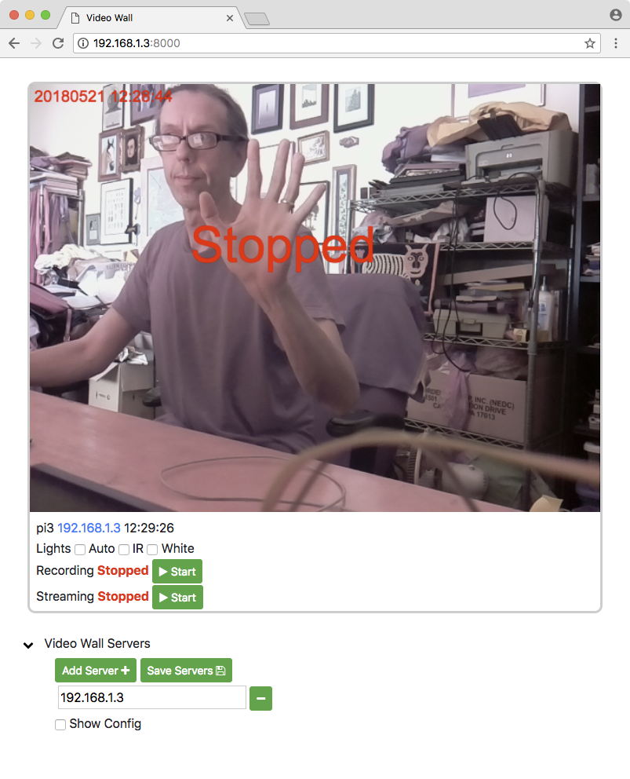

Videowall is a web server to view and control multiple copies of homecage on different Raspberry Pis!

## Install

	cd ~/homecage/videowall_app/
	./install-videowall.sh

## Starting and stopping videowall

	./videowall start
	./videowall stop
	./videowall restart
	./videowall status
	./videowall enable	# to start videowall at boot
	./videowall disable # to not start videowall at boot
		
## Browse

	http://[your_pi_ip]:8000

## Example

[install]: http://blog.cudmore.io/homecage/installing-the-software/